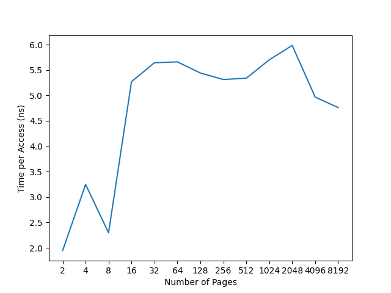
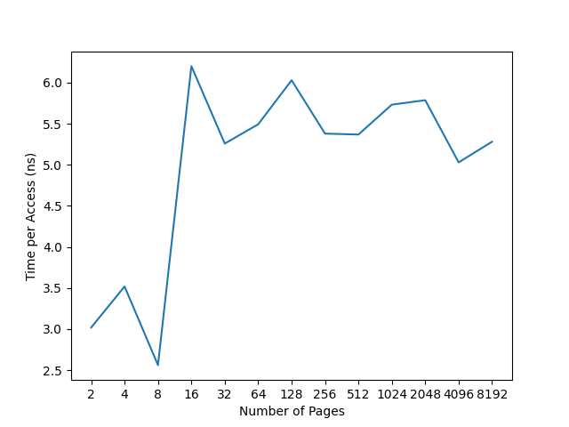
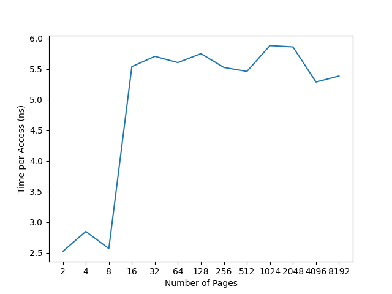

# Ch19 Paging: Faster Translations (TLBs)

## Contents

Virtualization

- Ch19 Paging: Faster Translations (TLBs)

    - 19.1 TLB Basic Algorithm

    - 19.2 Example: Accessing an Array

    - 19.3 Who Handles the TLB Miss?

    - 19.4 TLB Contents: What's in There?

    - 19.5 TLB Issue: Context Switches

    - 19.6 Issue: Replacement Policy

    - 19.7 A Real TLB Entry

    - 19.8 Summary

## Homework (Measurement)

### Questions

#### 1

- `clock_gettime()` has a precision of a nanosecond

#### 2

- `tlb.c`

#### 3

- When trying 100000 times, values has stabilized roughly.

```sh
$ gcc tlb.c -o tlb
$ python trace.py ./tlb 100000
2 average: 1.996305

4 average: 3.200613

8 average: 2.250209

16 average: 5.259243

32 average: 5.769615

64 average: 5.545818

128 average: 5.366588

256 average: 5.430793

512 average: 5.537903

1024 average: 5.849168

2048 average: 5.829295

4096 average: 4.952030

8192 average: 4.522195

```

#### 4

- `graph.py`

```sh
$ python graph.py ./tlb graph.png 100000
2 average: 1.947880

4 average: 3.248298

8 average: 2.296946

16 average: 5.270337

32 average: 5.644334

64 average: 5.659840

128 average: 5.441295

256 average: 5.313924

512 average: 5.339217

1024 average: 5.700478

2048 average: 5.984519

4096 average: 4.967947

8192 average: 4.761723

```



#### 5

- Do not use optimization options.

#### 6

- `tlb_one_cpu.c`

```
$ gcc tlb_one_cpu.c -o tlb_one_cpu
$ python graph.py ./tlb_one_cpu graph_one_cpu.png 100000
2 average: 3.018460

4 average: 3.518257

8 average: 2.560870

16 average: 6.200672

32 average: 5.258467

64 average: 5.493334

128 average: 6.029720

256 average: 5.379669

512 average: 5.368475

1024 average: 5.732386

2048 average: 5.786330

4096 average: 5.029425

8192 average: 5.280660

```



#### 7

- Use `calloc` instead of `malloc`.

- In the code above, `calloc` is used.

- If using `malloc`, the result is as follow.

```sh
$ python graph.py ./tlb_one_cpu graph_malloc.png 100000
2 average: 2.523475

4 average: 2.848765

8 average: 2.569310

16 average: 5.540608

32 average: 5.708304

64 average: 5.606558

128 average: 5.752237

256 average: 5.527752

512 average: 5.462927

1024 average: 5.884196

2048 average: 5.862453

4096 average: 5.289634

8192 average: 5.387912

```


