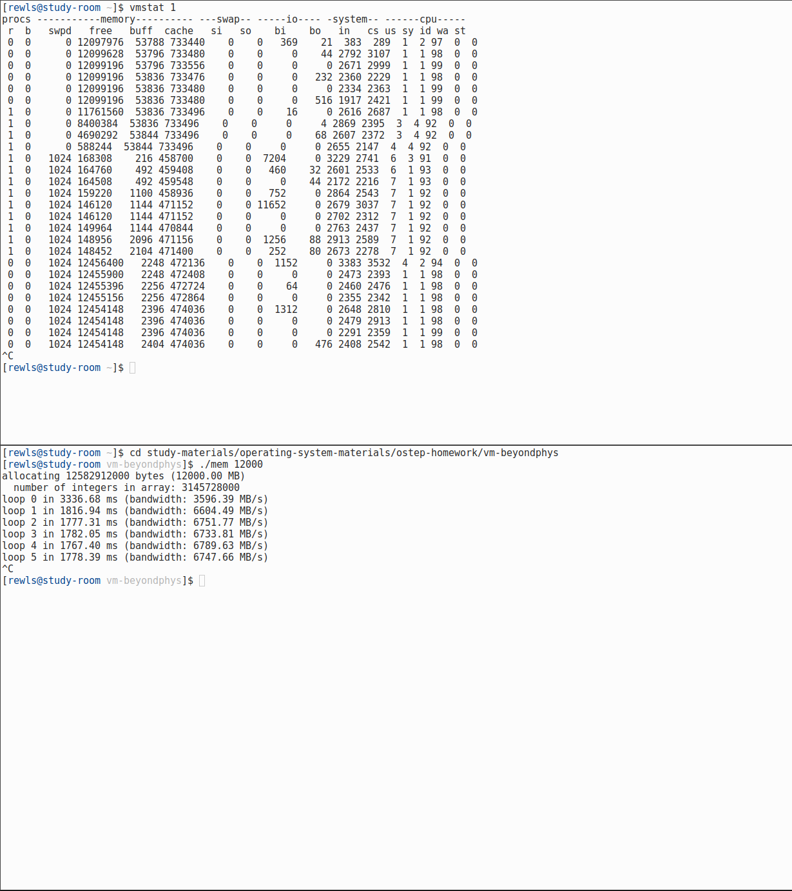
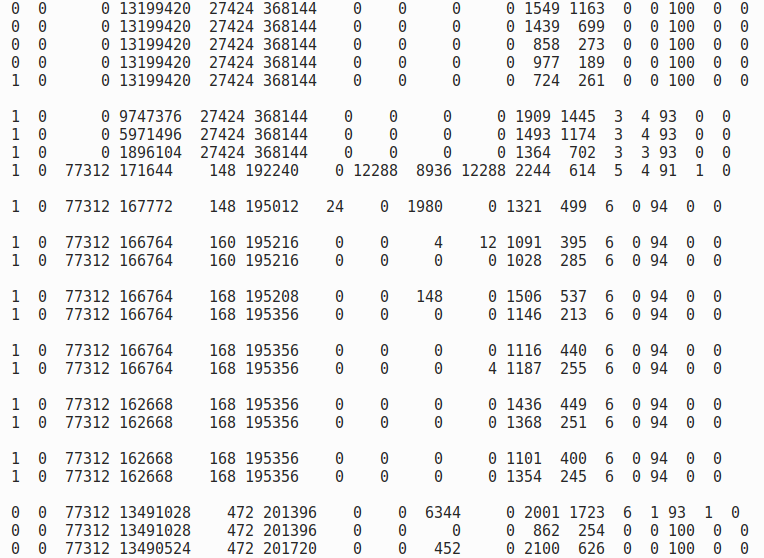
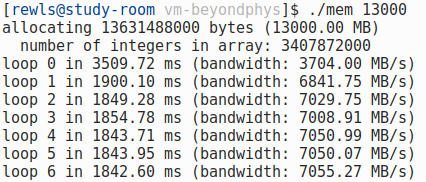
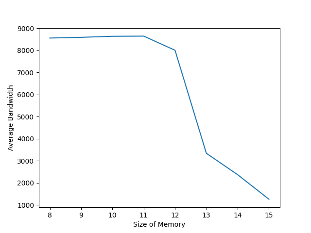

# Ch21 Beyond Physical Memory: Mechanisms

## Contents

Virtualization

- Ch21 Beyond Physical Memory: Mechanisms 

    - 21.1 Swap Space

    - 21.2 The Present Bit

    - 21.3 The Page Fault

    - 21.4 What If Memory is Full?

    - 21.5 Page Fault Control Flow

    - 21.6 When Replacements Really Occur

    - 21.7 Summary

## Homework (Measurement)

### Questions

#### 1

- The user time increases and the idle time decreases.

- The user time increases as more instances of `mem` at once.

#### 2

- When running `./mem 1024`, `free` decreased but `swpd` is still 0.

- Killing the running program increased `free` by the expected amount but didn't change `swpd`.

- Since `swpd` is the amount of swap memory used and the free memory in my system is about 12GB, `swpd` would not change.

- Instead, running `./mem 11500`, after `free` decreases below a certain level, `swpd` increases.

- Then killing the program, `free` increased more than expected and `swpd` was kept.



#### 3





- The amount of memory swapped to disk(`so`) increased to 12288 in the first loop, then became a zero.

- The amount of memory swapped in from disk(`si`) increased slightly then become a zero

#### 4

- Blocks sent to and received from a block device increased then became about zeros.

- The user time increased.

#### 5

```sh
$ ./mem 6000
allocating 6291456000 bytes (6000.00 MB)
  number of integers in array: 1572864000
loop 0 in 1761.53 ms (bandwidth: 3406.14 MB/s)
loop 1 in 926.71 ms (bandwidth: 6474.50 MB/s)
loop 2 in 872.43 ms (bandwidth: 6877.34 MB/s)
loop 3 in 868.82 ms (bandwidth: 6905.92 MB/s)
loop 4 in 868.56 ms (bandwidth: 6908.02 MB/s)
loop 5 in 867.59 ms (bandwidth: 6915.70 MB/s)
loop 6 in 867.16 ms (bandwidth: 6919.16 MB/s)
```

```sh
$ ./mem 15000
allocating 15728640000 bytes (15000.00 MB)
  number of integers in array: 3932160000
loop 0 in 19908.17 ms (bandwidth: 753.46 MB/s)
loop 1 in 118778.28 ms (bandwidth: 126.29 MB/s)
loop 2 in 11225.31 ms (bandwidth: 1336.27 MB/s)
loop 3 in 11147.93 ms (bandwidth: 1345.54 MB/s)
loop 4 in 11075.46 ms (bandwidth: 1354.35 MB/s)
loop 5 in 11281.14 ms (bandwidth: 1329.65 MB/s)
loop 6 in 9322.55 ms (bandwidth: 1609.00 MB/s)
loop 7 in 9518.40 ms (bandwidth: 1575.90 MB/s)
```



- For the former the first loop was slower than subsequent loops, but for the letter the second loop was particularly slow and except that the first loop was slower than subsequent loops.

#### 6

```sh
$ swapon -s
Filename                                Type            Size            Used            Priority
/dev/nvme0n1p2                          partition       4194300         596604          -2
```

```sh
$ free
               total        used        free      shared  buff/cache   available
Mem:        14172832     1520256    11862912       18920      789664    12363520
Swap:        4194300           0     4194300
```

```sh
$ ./mem 17937
allocating 18808307712 bytes (17937.00 MB)
memory allocation failed
malloc error: Cannot allocate memory
$ ./mem 17936
allocating 18807259136 bytes (17936.00 MB)
  number of integers in array: 4701814784
^C
```

$$
{14172832 + 4194300 \over 2^{10}} = 17936.65
$$
