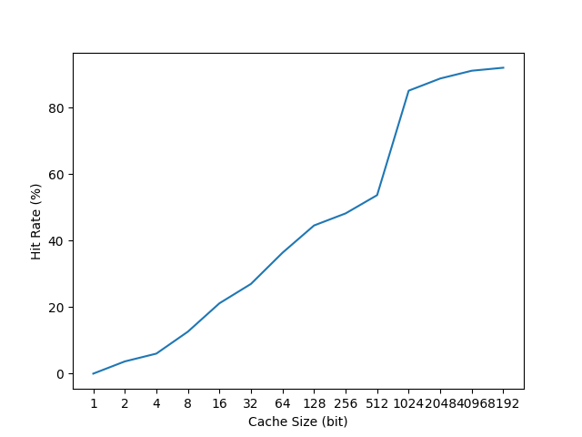

# Ch22 Beyond Physical Memory: Policies

## Contents

Virtualization

- Ch22 Beyond Physical Memory: Policies

    - 22.1 Cache Management

    - 22.2 The Optimal Replacement Policy

    - 22.3 A Simple Policy: FIFO

    - 22.4 Another Simple Policy: Random

    - 22.5 Using History: LRU

    - 22.6 Workload Examples

    - 22.7 Implementing Historical Algorithms

    - 22.8 Approximating LRU

    - 22.9 Considering Dirty Pages

    - 22.10 Other VM Policies

    - 22.11 Thrashing

## Homework (Simulation)

### Questions

#### 1

```sh
./paging-policy.py -s 0 -n 10
ARG addresses -1
ARG addressfile 
ARG numaddrs 10
ARG policy FIFO
ARG clockbits 2
ARG cachesize 3
ARG maxpage 10
ARG seed 0
ARG notrace False

Assuming a replacement policy of FIFO, and a cache of size 3 pages,
figure out whether each of the following page references hit or miss
in the page cache.

Access: 8  Hit/Miss?  State of Memory?
Access: 7  Hit/Miss?  State of Memory?
Access: 4  Hit/Miss?  State of Memory?
Access: 2  Hit/Miss?  State of Memory?
Access: 5  Hit/Miss?  State of Memory?
Access: 4  Hit/Miss?  State of Memory?
Access: 7  Hit/Miss?  State of Memory?
Access: 3  Hit/Miss?  State of Memory?
Access: 4  Hit/Miss?  State of Memory?
Access: 5  Hit/Miss?  State of Memory?
```

```
Access: 8  MISS FirstIn-> [8]       <-Lastin Replace:- [Hits:0 Misses:1]
Access: 7  MISS FirstIn-> [8, 7]    <-Lastin Replace:- [Hits:0 Misses:2]
Access: 4  MISS FirstIn-> [8, 7, 4] <-Lastin Replace:- [Hits:0 Misses:3]
Access: 2  MISS FirstIn-> [7, 4, 2] <-Lastin Replace:8 [Hits:0 Misses:4]
Access: 5  MISS FirstIn-> [4, 2, 5] <-Lastin Replace:7 [Hits:0 Misses:5]
Access: 4  HIT  FirstIn-> [4, 2, 5] <-Lastin Replace:- [Hits:1 Misses:5]
Access: 7  MISS FirstIn-> [2, 5, 7] <-Lastin Replace:4 [Hits:1 Misses:6]
Access: 3  MISS FirstIn-> [5, 7, 3] <-Lastin Replace:2 [Hits:1 Misses:7]
Access: 4  MISS FirstIn-> [7, 3, 4] <-Lastin Replace:5 [Hits:1 Misses:8]
Access: 5  MISS FirstIn-> [3, 4, 5] <-Lastin Replace:7 [Hits:1 Misses:9]

hits 1 misses 9 hitrate 10%
```

```sh
$ ./paging-policy.py -s 1 -n 10 -p LRU
ARG addresses -1
ARG addressfile 
ARG numaddrs 10
ARG policy LRU
ARG clockbits 2
ARG cachesize 3
ARG maxpage 10
ARG seed 1
ARG notrace False

Assuming a replacement policy of LRU, and a cache of size 3 pages,
figure out whether each of the following page references hit or miss
in the page cache.

Access: 1  Hit/Miss?  State of Memory?
Access: 8  Hit/Miss?  State of Memory?
Access: 7  Hit/Miss?  State of Memory?
Access: 2  Hit/Miss?  State of Memory?
Access: 4  Hit/Miss?  State of Memory?
Access: 4  Hit/Miss?  State of Memory?
Access: 6  Hit/Miss?  State of Memory?
Access: 7  Hit/Miss?  State of Memory?
Access: 0  Hit/Miss?  State of Memory?
Access: 0  Hit/Miss?  State of Memory?
```

```sh
Access: 1  MISS LRU-> [1]       <-MRU Replace:- [Hits:0 Misses:1]
Access: 8  MISS LRU-> [1, 8]    <-MRU Replace:- [Hits:0 Misses:2]
Access: 7  MISS LRU-> [1, 8, 7] <-MRU Replace:- [Hits:0 Misses:3]
Access: 2  MISS LRU-> [8, 7, 2] <-MRU Replace:1 [Hits:0 Misses:4]
Access: 4  MISS LRU-> [7, 2, 4] <-MRU Replace:8 [Hits:0 Misses:5]
Access: 4  HIT  LRU-> [7, 2, 4] <-MRU Replace:- [Hits:1 Misses:5]
Access: 6  MISS LRU-> [2, 4, 6] <-MRU Replace:7 [Hits:1 Misses:6]
Access: 7  MISS LRU-> [4, 6, 7] <-MRU Replace:2 [Hits:1 Misses:7]
Access: 0  MISS LRU-> [6, 7, 0] <-MRU Replace:4 [Hits:1 Misses:8]
Access: 0  HIT  LRU-> [6, 7, 0] <-MRU Replace:- [Hits:2 Misses:8]

hits 2 misses 8 hitrate 20%
```

```sh
$ ./paging-policy.py -s 2 -n 10 -p OPT
ARG addresses -1
ARG addressfile 
ARG numaddrs 10
ARG policy OPT
ARG clockbits 2
ARG cachesize 3
ARG maxpage 10
ARG seed 2
ARG notrace False

Assuming a replacement policy of OPT, and a cache of size 3 pages,
figure out whether each of the following page references hit or miss
in the page cache.

Access: 9  Hit/Miss?  State of Memory?
Access: 9  Hit/Miss?  State of Memory?
Access: 0  Hit/Miss?  State of Memory?
Access: 0  Hit/Miss?  State of Memory?
Access: 8  Hit/Miss?  State of Memory?
Access: 7  Hit/Miss?  State of Memory?
Access: 6  Hit/Miss?  State of Memory?
Access: 3  Hit/Miss?  State of Memory?
Access: 6  Hit/Miss?  State of Memory?
Access: 6  Hit/Miss?  State of Memory?
```

```
Access: 9  MISS Left-> [9]       <-Right Replaced:- [Hits:0 Misses:1]
Access: 9  HIT  Left-> [9]       <-Right Replaced:- [Hits:1 Misses:1]
Access: 0  MISS Left-> [9, 0]    <-Right Replaced:- [Hits:1 Misses:2]
Access: 0  HIT  Left-> [9, 0]    <-Right Replaced:- [Hits:2 Misses:2]
Access: 8  MISS Left-> [9, 0, 8] <-Right Replaced:- [Hits:2 Misses:3]
Access: 7  MISS Left-> [0, 8, 7] <-Right Replaced:9 [Hits:2 Misses:4]
Access: 6  MISS Left-> [8, 7, 6] <-Right Replaced:0 [Hits:2 Misses:5]
Access: 3  MISS Left-> [7, 6, 3] <-Right Replaced:8 [Hits:2 Misses:6]
Access: 6  HIT  Left-> [7, 6, 3] <-Right Replaced:- [Hits:3 Misses:6]
Access: 6  HIT  Left-> [7, 6, 3] <-Right Replaced:- [Hits:4 Misses:6]

FINALSTATS hits 4 misses 6 hitrate 40%
```

#### 2

```sh
$ ./paging-policy.py -c 5 -a 0,1,2,3,4,5,0,1,2,3 -c
ARG addresses 0,1,2,3,4,5,0,1,2,3
ARG addressfile 
ARG numaddrs 10
ARG policy FIFO
ARG clockbits 2
ARG cachesize 3
ARG maxpage 10
ARG seed 0
ARG notrace False

Solving...

Access: 0  MISS FirstIn ->          [0] <- Lastin  Replaced:- [Hits:0 Misses:1]
Access: 1  MISS FirstIn ->       [0, 1] <- Lastin  Replaced:- [Hits:0 Misses:2]
Access: 2  MISS FirstIn ->    [0, 1, 2] <- Lastin  Replaced:- [Hits:0 Misses:3]
Access: 3  MISS FirstIn ->    [1, 2, 3] <- Lastin  Replaced:0 [Hits:0 Misses:4]
Access: 4  MISS FirstIn ->    [2, 3, 4] <- Lastin  Replaced:1 [Hits:0 Misses:5]
Access: 5  MISS FirstIn ->    [3, 4, 5] <- Lastin  Replaced:2 [Hits:0 Misses:6]
Access: 0  MISS FirstIn ->    [4, 5, 0] <- Lastin  Replaced:3 [Hits:0 Misses:7]
Access: 1  MISS FirstIn ->    [5, 0, 1] <- Lastin  Replaced:4 [Hits:0 Misses:8]
Access: 2  MISS FirstIn ->    [0, 1, 2] <- Lastin  Replaced:5 [Hits:0 Misses:9]
Access: 3  MISS FirstIn ->    [1, 2, 3] <- Lastin  Replaced:0 [Hits:0 Misses:10]

FINALSTATS hits 0   misses 10   hitrate 0.00
```

```sh
$ ./paging-policy.py -C 5 -p LRU -a 0,1,2,3,4,5,0,1,2,3 -c
ARG addresses 0,1,2,3,4,5,0,1,2,3
ARG addressfile 
ARG numaddrs 10
ARG policy LRU
ARG clockbits 2
ARG cachesize 5
ARG maxpage 10
ARG seed 0
ARG notrace False

Solving...

Access: 0  MISS LRU ->          [0] <- MRU Replaced:- [Hits:0 Misses:1]
Access: 1  MISS LRU ->       [0, 1] <- MRU Replaced:- [Hits:0 Misses:2]
Access: 2  MISS LRU ->    [0, 1, 2] <- MRU Replaced:- [Hits:0 Misses:3]
Access: 3  MISS LRU -> [0, 1, 2, 3] <- MRU Replaced:- [Hits:0 Misses:4]
Access: 4  MISS LRU -> [0, 1, 2, 3, 4] <- MRU Replaced:- [Hits:0 Misses:5]
Access: 5  MISS LRU -> [1, 2, 3, 4, 5] <- MRU Replaced:0 [Hits:0 Misses:6]
Access: 0  MISS LRU -> [2, 3, 4, 5, 0] <- MRU Replaced:1 [Hits:0 Misses:7]
Access: 1  MISS LRU -> [3, 4, 5, 0, 1] <- MRU Replaced:2 [Hits:0 Misses:8]
Access: 2  MISS LRU -> [4, 5, 0, 1, 2] <- MRU Replaced:3 [Hits:0 Misses:9]
Access: 3  MISS LRU -> [5, 0, 1, 2, 3] <- MRU Replaced:4 [Hits:0 Misses:10]

FINALSTATS hits 0   misses 10   hitrate 0.00
```

```sh
$ ./paging-policy.py -C 5 -p MRU -a 0,1,2,3,4,5,4,5,4,5 -c
ARG addresses 0,1,2,3,4,5,4,5,4,5
ARG addressfile 
ARG numaddrs 10
ARG policy MRU
ARG clockbits 2
ARG cachesize 5
ARG maxpage 10
ARG seed 0
ARG notrace False

Solving...

Access: 0  MISS LRU ->          [0] <- MRU Replaced:- [Hits:0 Misses:1]
Access: 1  MISS LRU ->       [0, 1] <- MRU Replaced:- [Hits:0 Misses:2]
Access: 2  MISS LRU ->    [0, 1, 2] <- MRU Replaced:- [Hits:0 Misses:3]
Access: 3  MISS LRU -> [0, 1, 2, 3] <- MRU Replaced:- [Hits:0 Misses:4]
Access: 4  MISS LRU -> [0, 1, 2, 3, 4] <- MRU Replaced:- [Hits:0 Misses:5]
Access: 5  MISS LRU -> [0, 1, 2, 3, 5] <- MRU Replaced:4 [Hits:0 Misses:6]
Access: 4  MISS LRU -> [0, 1, 2, 3, 4] <- MRU Replaced:5 [Hits:0 Misses:7]
Access: 5  MISS LRU -> [0, 1, 2, 3, 5] <- MRU Replaced:4 [Hits:0 Misses:8]
Access: 4  MISS LRU -> [0, 1, 2, 3, 4] <- MRU Replaced:5 [Hits:0 Misses:9]
Access: 5  MISS LRU -> [0, 1, 2, 3, 5] <- MRU Replaced:4 [Hits:0 Misses:10]

FINALSTATS hits 0   misses 10   hitrate 0.00
```

#### 3

- Like Figure 22.6, except for OPT, all policies would show similar performance.

```sh
$ ./paging-policy.py -s 10 -c
...
FINALSTATS hits 2   misses 8   hitrate 20.00
$ ./paging-policy.py -s 10 -p LRU -c
...
FINALSTATS hits 2   misses 8   hitrate 20.00
$ ./paging-policy.py -s 10 -p OPT -c
...
FINALSTATS hits 3   misses 7   hitrate 30.00
$ ./paging-policy.py -s 10 -p UNOPT -c
...
FINALSTATS hits 2   misses 8   hitrate 20.00
$ ./paging-policy.py -s 10 -p RAND -c
...
FINALSTATS hits 2   misses 8   hitrate 20.00
$ ./paging-policy.py -s 10 -p CLOCK -c
...
FINALSTATS hits 2   misses 8   hitrate 20.00
```

#### 4

```sh
$ python 80-20-workload.py
[6, 1, 0, 0, 1, 1, 1, 7, 1, 0]
```

```sh
$ ./paging-policy.py -p LRU -a 6,1,0,0,1,1,1,7,1,0
...
FINALSTATS hits 6   misses 4   hitrate 60.00
$ ./paging-policy.py -p RAND -a 6,1,0,0,1,1,1,7,1,0 -c
...
FINALSTATS hits 5   misses 5   hitrate 50.00
```

- In this workload, LRU was 10% better than RAND.

```sh
$ ./paging-policy.py -p CLOCK -b 1 -a 6,1,0,0,1,1,1,7,1,0 -b 0 -c
...
FINALSTATS hits 5   misses 5   hitrate 50.00
$ ./paging-policy.py -p CLOCK -a 6,1,0,0,1,1,1,7,1,0 -b 1 -c
...
FINALSTATS hits 5   misses 5   hitrate 50.00
$ ./paging-policy.py -p CLOCK -a 6,1,0,0,1,1,1,7,1,0 -b 2 -c
...
FINALSTATS hits 5   misses 5   hitrate 50.00
$ ./paging-policy.py -p CLOCK -a 6,1,0,0,1,1,1,7,1,0 -b 3 -c
...
FINALSTATS hits 5   misses 5   hitrate 50.00
$ ./paging-policy.py -p CLOCK -a 6,1,0,0,1,1,1,7,1,0 -b 4 -c
...
FINALSTATS hits 5   misses 5   hitrate 50.00
```

- In this workload, even though the clock bit size was different, the hitrate was the same.

#### 5

```sh
$ valgrind --log-file="trace.txt" --tool=lackey --trace-mem=yes ls
...
$ python graph.py graph.png
$
```


